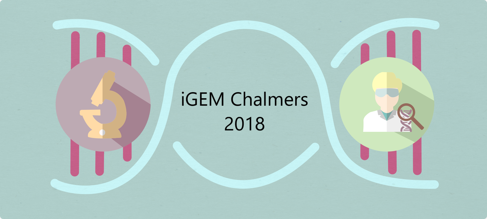

Welcome to our project repositorty, a supplement to our [Wiki page](http://2018.igem.org/Team:Chalmers-Gothenburg).

# 

Here we present and make available our framework for community dynamic flux balance analysis simulations, COM-dFBA. Additionaly, we include the reconstruction script for generating a draft genome scale model for the probiotic _Saccharomyces boulardii_.

## Citation

This repository makes use of the [RAVEN toolbox](https://github.com/SysBioChalmers/RAVEN/). Please follow their installation instructions if any problems arise.

  >Agren R _et al_. (2013) PLoS Comput Biol 9(3): e1002980. doi:[10.1371/journal.pcbi.1002980](http://journals.plos.org/ploscompbiol/article?id=10.1371/journal.pcbi.1002980).

## Acknowledgements

We would like to thank the following people for providing guidance, feedback, and support in our modeling approach: Eduard Kerkhoven, Benjamin Sanchez, Avlant Nilsson, Raphael Ferreira, Boyang Ji, and Angelo Limeta. Additionally, we would like to thank everyone in the [Systems & Synthetic Biology](www.sysbio.se/) division at Chalmers, for providing us with a friendly and open work environment.

##
